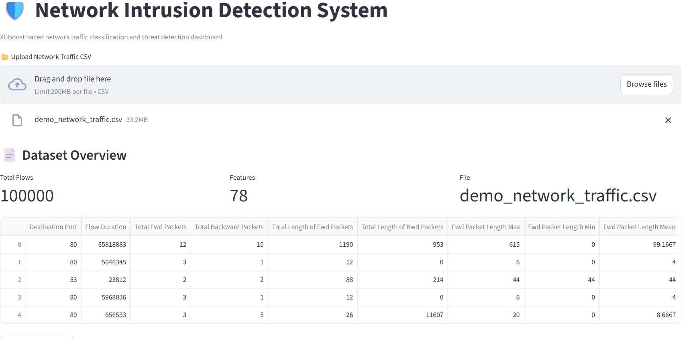
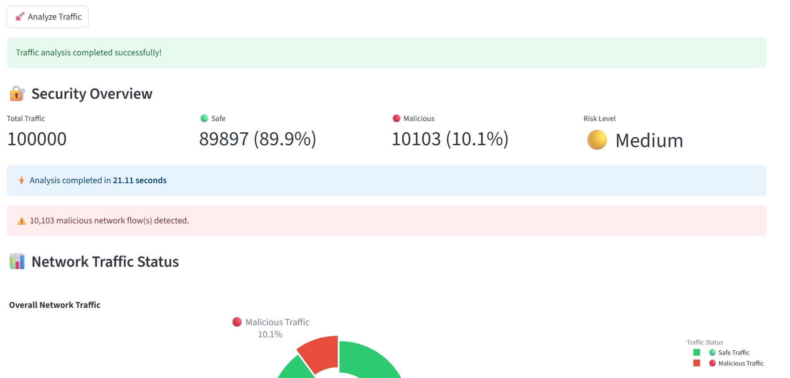
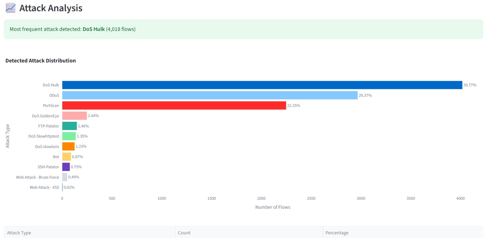
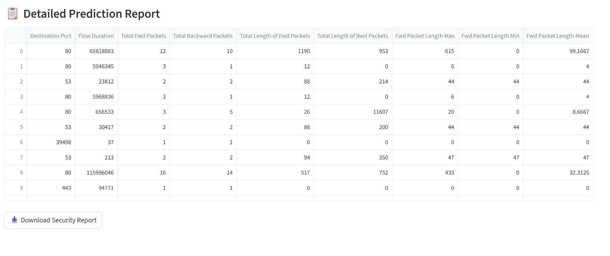

# 🛡️ Network Intrusion Detection System

> **Enterprise-grade Machine Learning system for detecting malicious network traffic using XGBoost, FastAPI, Streamlit, Docker, and AWS EC2.**


---

## 📌 Project Overview

This project is an end-to-end **Machine Learning Network Intrusion Detection System** that classifies network traffic into **Benign** or multiple attack categories. It provides a **FastAPI REST API** for inference and a **Streamlit dashboard** for batch CSV prediction with interactive analytics.

---


## ✨ Features

- 🚀 XGBoost-based Intrusion Detection
- 🌐 FastAPI REST API
- 📊 Interactive Streamlit Dashboard
- 📁 Batch CSV Prediction
- 📈 Attack Distribution & Security Analytics
- 🎯 Confidence Score for every prediction
- 🐳 Docker & Docker Compose Support
- ☁️ AWS EC2 Deployment

---

## 🏗️ Architecture

```text
Network Traffic CSV
        │
        ▼
 Data Preprocessing
        │
        ▼
 Feature Engineering
        │
        ▼
   XGBoost Model
        │
  ┌─────┴─────┐
  ▼           ▼
FastAPI   Streamlit
        │
        ▼
 Prediction Results
```

---

## 📂 Project Structure

```text
Network-Intrusion-Detection-System/
│
├── .github/
│   └── workflows/
│       └── ci.yml
│
├── Data/
│   ├── raw/
│   └── processed/
│
├── models/
│   ├── intrusion_model.pkl
│   ├── feature_columns.pkl
│   └── label_encoder.pkl
│
├── notebooks/
│   └── EDA.ipynb
│
├── scripts/
│   ├── prepare_data.py
│   ├── train_model.py
│   └── evaluate_model.py
│
├── src/
│   ├── app/
│   ├── data/
│   ├── features/
│   ├── serving/
│   └── utils/
│
├── streamlit_app/
│   ├── app.py
│   ├── api.py
│   ├── preprocessing.py
│   ├── visualization.py
│   └── utils.py
│
├── Dockerfile
├── Dockerfile.streamlit
├── docker-compose.yml
├── requirements.txt
└── README.md
```

---

## 🛠️ Tech Stack

| Category | Technologies |
|----------|--------------|
| Language | Python |
| Machine Learning | XGBoost, Scikit-learn |
| Backend | FastAPI, Uvicorn |
| Frontend | Streamlit |
| Data Processing | Pandas, NumPy |
| Visualization | Plotly |
| Deployment | Docker, Docker Compose |
| Cloud | AWS EC2 |
| CI/CD | GitHub Actions |

---

## 🚀 Local Setup

```bash
git clone https://github.com/arunmadapathi-1609/Network-Intrusion-Detection-System.git

cd Network-Intrusion-Detection-System

python -m venv .venv

# Windows
.venv\Scripts\activate

pip install -r requirements.txt
```

### Run FastAPI

```bash
uvicorn src.app.main:app --reload
```

Open:

```
http://localhost:8000/docs
```

### Run Streamlit

```bash
streamlit run streamlit_app/app.py
```

Open:

```
http://localhost:8501
```

---

## 🐳 Docker

```bash
docker-compose build

docker-compose up -d
```

---

## ☁️ AWS EC2 Deployment

- Ubuntu 24.04 LTS
- Docker Engine
- Docker Compose
- FastAPI + Streamlit Containers
- Public EC2 Deployment
- REST API Documentation

---

## 📡 API Endpoints

| Method | Endpoint | Description |
|---------|----------|-------------|
| GET | `/` | API Status |
| GET | `/health` | Health Check |
| POST | `/predict` | Single Prediction |
| POST | `/predict_batch` | Batch Prediction |

---

## 📊 Dashboard

### 🏠 Streamlit Dashboard



### 🛡️ Security Overview 


### 📊 Attack Analysis



### 📋 Prediction Report



---